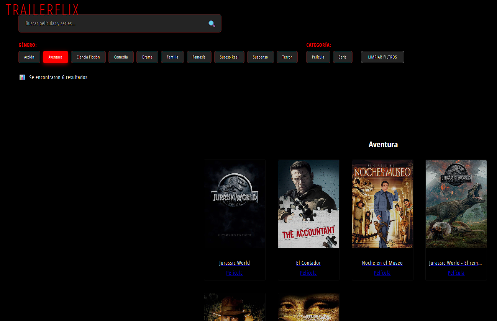
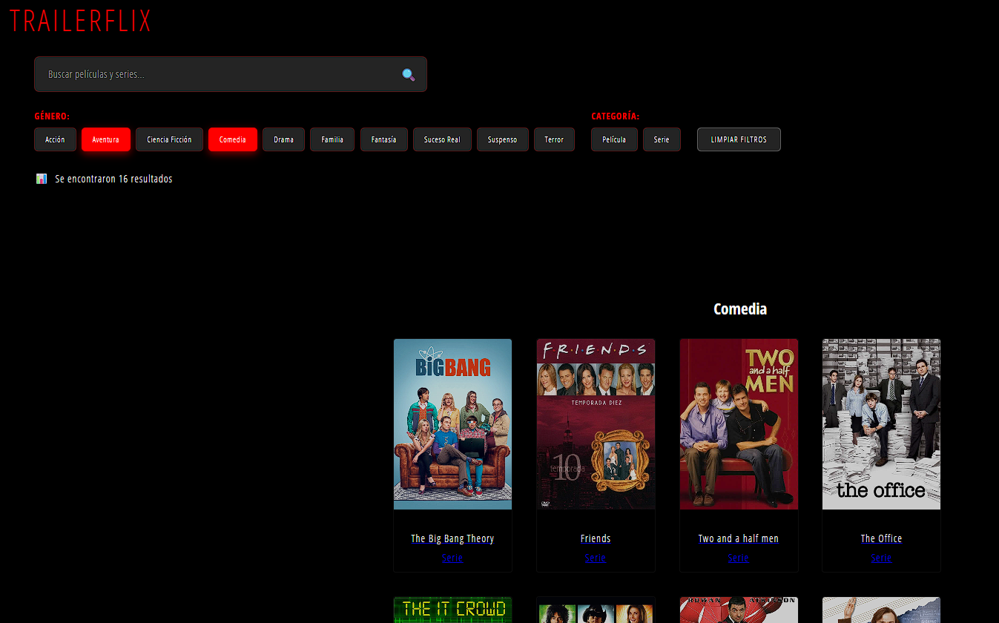
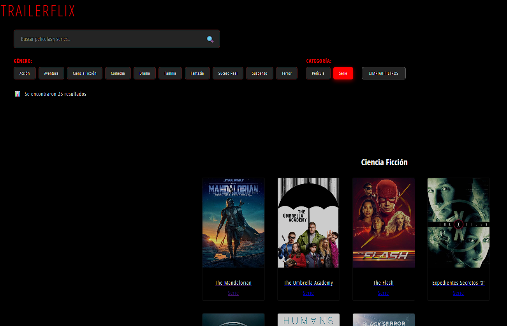
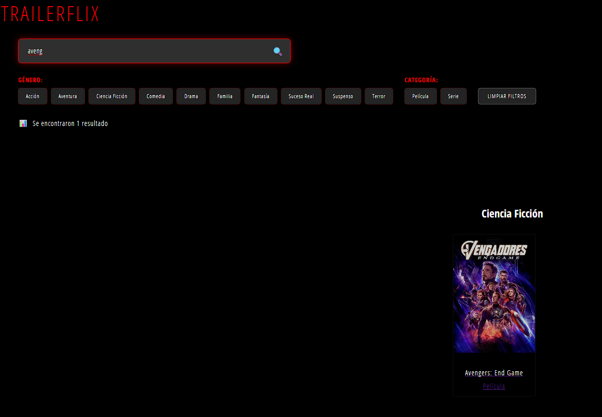
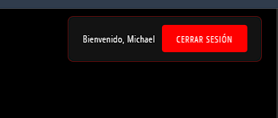

# Trailerflix - Migración a React + Vite

## Estructura del Proyecto
- public/data/trailerflix.json
- public/data/usuarios.json
- public/posters/
  - movie1.jpg
  - movie2.jpg
  - ...
- src/
  - components/
    - Header.jsx
    - Login.jsx
    - MovieCard.jsx
    - SearchBar.jsx
    - Filters.jsx
  - context/
    - AuthContext.jsx
  - hooks/
    - useAuth.js
    - useFilterMovies.js
  - pages/
    - Home.jsx
    - MovieDetail.jsx
    - NotFound.jsx
  - App.jsx
  - main.jsx
  - style.css

## Ejecutar
1. `npm install`
2. `npm run dev`
3. Abrir el puerto que indique Vite en el navegador (normalmente http://localhost:5173)
4. ¡Disfruta de Trailerflix!

## Testing
-Filtros

-Filtros combinados

-Filtro de peliculas o series

-Búsqueda

-Login
